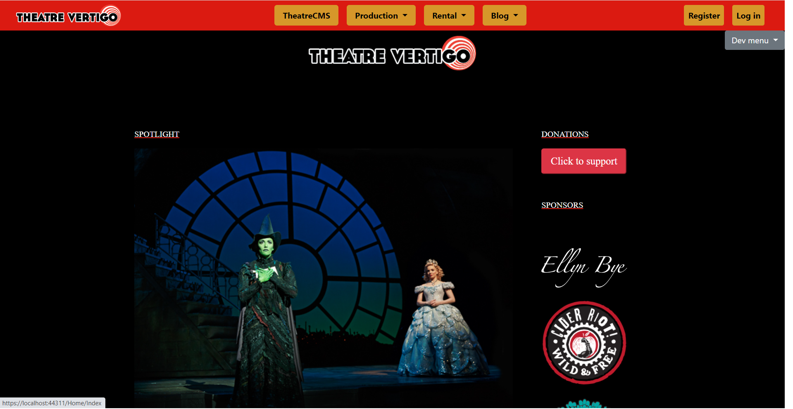
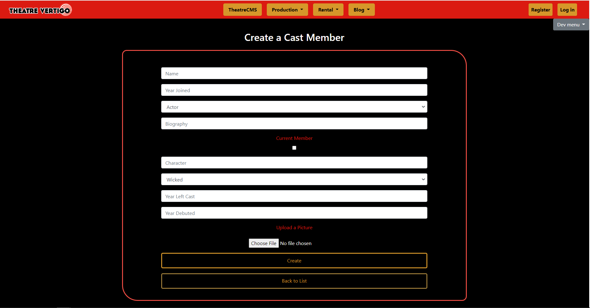

# Live_Project

<h2 align="center">Vertigo Theatre Website</h2>



<h2>Index</h2>
<ul>
  <li><a href="#intro">Description</a></li>
  <li><a href="#entities">Building Entities</a></li>
  <li><a href="#photostorage">Converting a Picture for Storage</a></li>
  <li><a href="#skills">In Finality: Skills</li>
</ul>


<h2 id="intro">Description</h2>
<p>As part of our curriculum, we were tasked with a two-week sprint where we had to implement certain functionality within the Vertigo Theatre . This was done with other students as my teammates and instructors as project managers. Working according to the Agile methodology and within the scrum framework, I completed several stories where I implemented the ability to CRUD a cast member.</p>

<p><strong>Technologies used by me were:</strong></p>
<ul>
  <li>Visual Studio</li>
  <li>Azure DevOps</li>
  <li>ASP.NET</li>
  <li>C#</li>
  <li>HTML</li>
  <li>CSS</li>
  <li>Razor syntax</li>
</ul>

<h2 id="entities">Building Entities</h2>
<p>Successful websites require simple CRUD functionality. One story had me creating and styling the 'Create' portion. Check out the code and screenshot.</p>

```c#
namespace TheatreCMS3.Areas.Prod.Models
{
    public class CastMember
    {
        // This will create PK using VS convention [className]Id
        public int CastMemberId { get; set; }
        public string Name { get; set; }
        public int? YearJoined { get; set; }
        public Placement MainRole { get; set; }
        public string Bio { get; set; }
        public Byte[] Photo { get; set; }
        public bool CurrentMember { get; set; }
        public string Character { get; set; }
        public Production CurrentProduction { get; set; }
        public int? CastYearLeft { get; set; }
        public int? DebutYear { get; set; }
    }

    // An enum is a user-defined value type used to represent a list of named integer constants.
    // Here, we're using it to give our 'Placement' property a list of roles.
    public enum Placement
    {
        Actor,
        Director,
        Technician,
        [Display(Name = "Stage Manager")]
        StageManager,
        Other
    }

    public enum Production
    {
        Wicked,
        Hamilton,
        // Using System.ComponentModel.DataAnnotations, we're able to output a UI-friendly display name.
        [Display(Name = "The Lion King")]
        TheLionKing,
        [Display(Name = "Les Miserables")]
        LesMiserables,
    }
}
```




<h2 id="photostorage">Converting a Picture for Storage</h2>
<p>Within the CastMember entity was a byte array (Byte[]) that was to be associated with a user-uploaded photo in the database (dB). Any uploaded image had to be converted to a Byte[] before being able to be stored in the dB. A method in the controller accomplished this.</p>
<br>
<p>An interesting side note is that the HttpPostedFile class used to accept the user-uploaded photo from the HTML file input tag has a default-maximum size of 4MB. This is able to be overwritten using the MaxRequestLength property or by setting the maxRequestLength attribute of the httpRuntime Element element within the Machine.config or Web.config file.</p>

```c#
        public byte[] ConvertImage(HttpPostedFileBase image)
        {
            // Initializing empty byte array
            byte[] imageByteArray;

            // BinaryReader provides methods that simplify reading primitive data types from a stream.
            // In our case, the stream will be the client uploaded file 'image' from the 'Create' view.
            using (BinaryReader br = new BinaryReader(image.InputStream))
            {
                imageByteArray = br.ReadBytes(image.ContentLength);
            }
            return imageByteArray;
        }
```

<p>With the above method complete, we're able to assign it to our entity (CastMember) 'Photo' property:</p>

```c#
        [HttpPost]
        [ValidateAntiForgeryToken]
        public ActionResult Create([Bind(Include = "CastMemberId,Name,YearJoined,MainRole,Bio,CurrentMember,Character,CastYearLeft,DebutYear,Photo")] CastMember castMember, HttpPostedFileBase image)
        {
            if (ModelState.IsValid)
            {
                // imageByteArray is being assigned to the castMember.Photo property here.
                castMember.Photo = ConvertImage(image);
                db.CastMembers.Add(castMember);
                db.SaveChanges();
                return RedirectToAction("Index");
            }

            return View(castMember);
        }
```

<h2 id="skills">In Finality: Skills</h2>
<p>This project allowed me to further hone several skills. They include:</p>
<ul>
  <li>Coding <strong>C#</strong></li>
  <li>Coding <strong>CSS</strong></li>
  <li>Coding <strong>HTML</strong></li>
  <li>Coding Razor (.cshtml) syntax</li>
  <li>Working within the <strong>ASP.NET</strong> framework</li>
  <li>Working with an <strong>MVC</strong> architectural pattern</li>
  <li>Working with <strong>Azure DevOps</strong></li>
  <li>Working within the <strong>Scrum</strong> framework</li>
  <li>Working with the <strong>Agile</strong> methodology</li>
</ul>

<p>Overall, <strong>communication</strong> with project managers and co-workers was one of the master keys which led to a successful venture.</p>
<br>
<p>Thank you for your time.</p>


  
